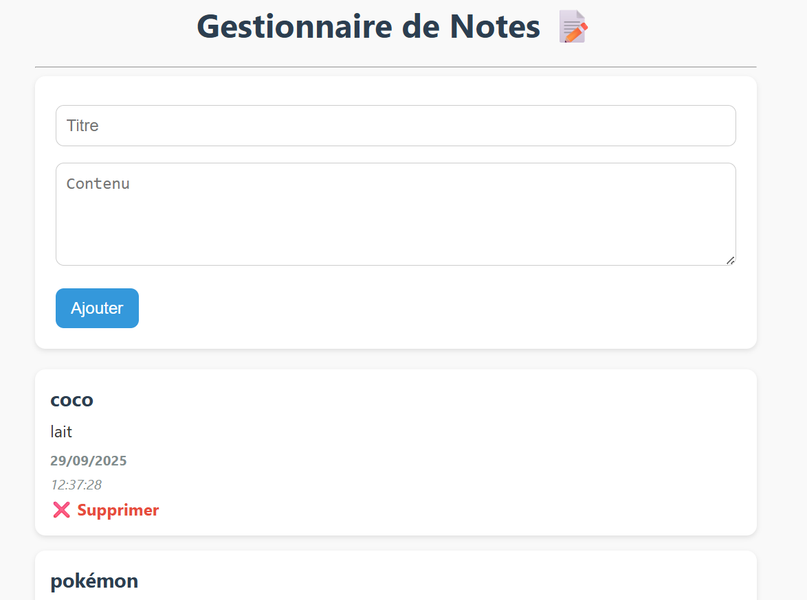
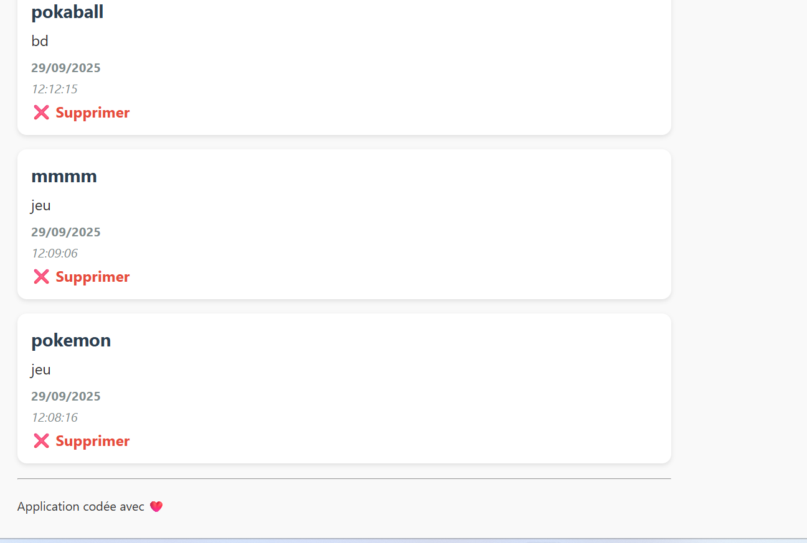

# Gestionnaire de Notes 📝

## Présentation
Cette application te permet de **gérer tes notes** facilement :  

- Ajouter une note (titre + contenu)  
- Voir toutes les notes avec la date et l'heure  
- Supprimer une note  

C’est une **mini-app PHP** avec **SQLite**.

---

## Pré-requis ✅
Avant de commencer, il te faut :  

- **PHP** installé sur ton ordinateur  
- **SQLite** (inclus avec PHP normalement)  
- Un **navigateur web** (Chrome, Firefox…)

---

## Installation et lancement 🚀

1️⃣ **Télécharge le projet** ou clone-le dans ton dossier local, par exemple :  
## Capture d'écran 📸

